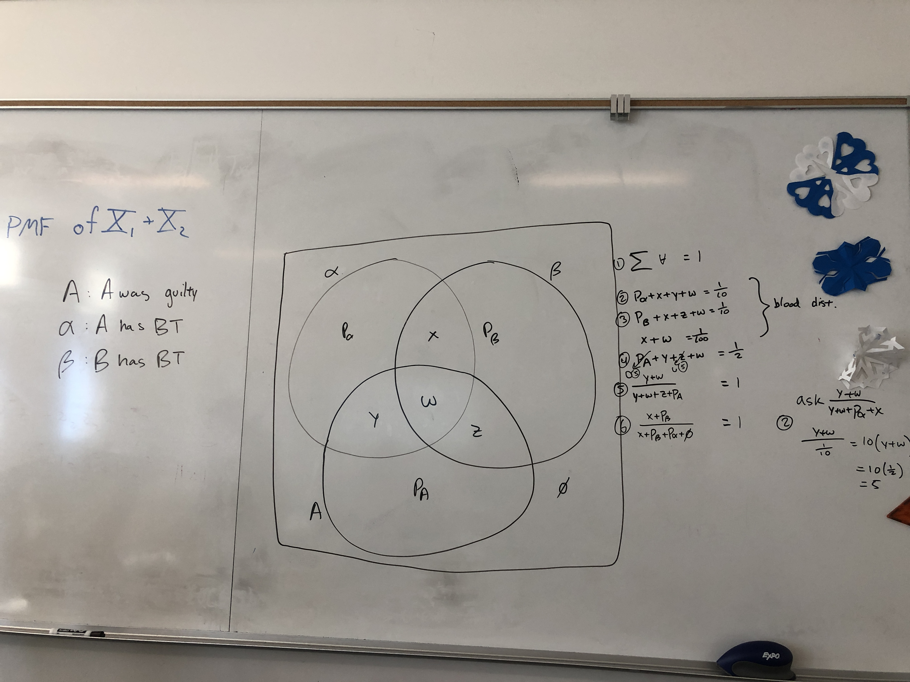

# Overview

In the Conditional Probability unit of MATH565 Advanced Probability, we covered two conditional probability problems that seem very similar but are solved in fundamentally different ways. One problem gives probabilities of events as hard values and is solved using the "tree method", and the other gives conditional probabilities and is solved using a Venn diagram and system of equations. It feels like we should be able to solve both problems using both methods by interoping between them using Bayes theorem, but this doesn't seem to work...

# The Problems

## The Bloodtype Problem

We can solve it by creating a branching tree of the probabilities, crossing out branches that are invalidated by new information, then multiplying the probabilities through and computing the ratio of $\frac{\mathcal P(A \cap B)}{\mathcal P(B)}$ (Bayes theorem). This is equivalent to solving by populating a table.

## The Abuse Problem

We can solve it by breaking it into its components and solving the system of equations: 

# Reconciliation
However, we don't know how to solve each problem using the other method. For instance, how do you encode ratios of probabilities in the tree (for solving the Abuse problem using a tree)? 

Solving the bloodtype problem with a Venn Diagram doesn't work either. When we add the last two equations, which encode that the murderer must match the blood type found at the crime scene, some numbers go to zero and the system of equations no longer solves to within the range $[0, 1]$:

*When trying to solve the bloodtype problem with a venn diagram, equations 5 and 6 cause the probability to be 5, which makes no sense.*

Why can't we use either method to solve problems? What causes a problem to be solvable by the Venn diagrams + components + algebra method, vs. the tree/table elimination method? Are there problems that can be solved using both?
